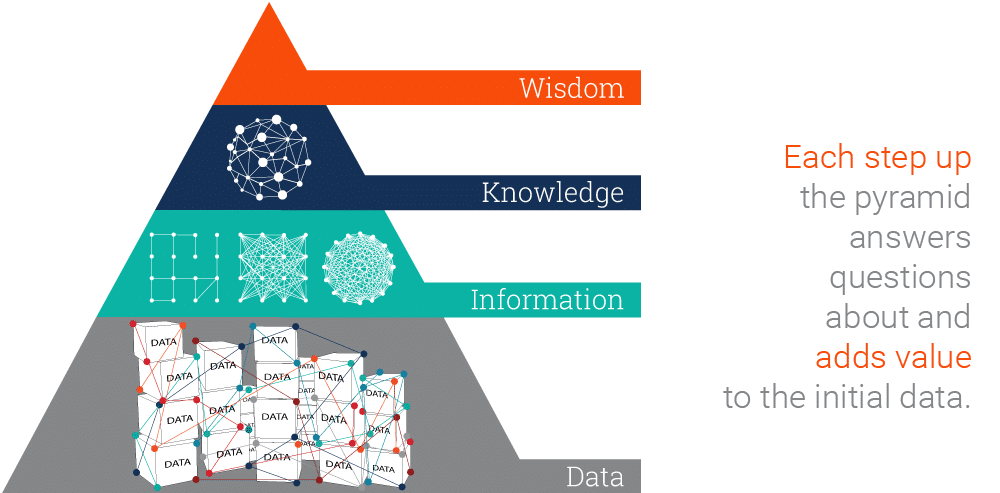
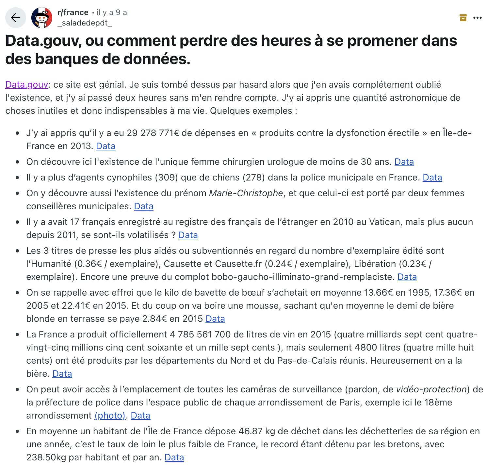
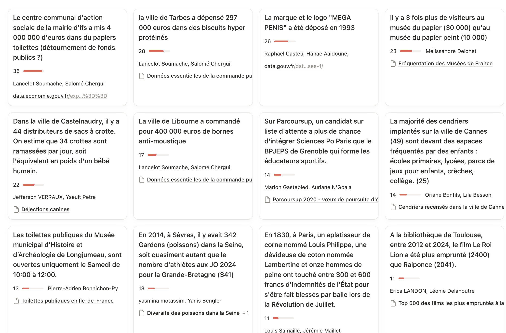
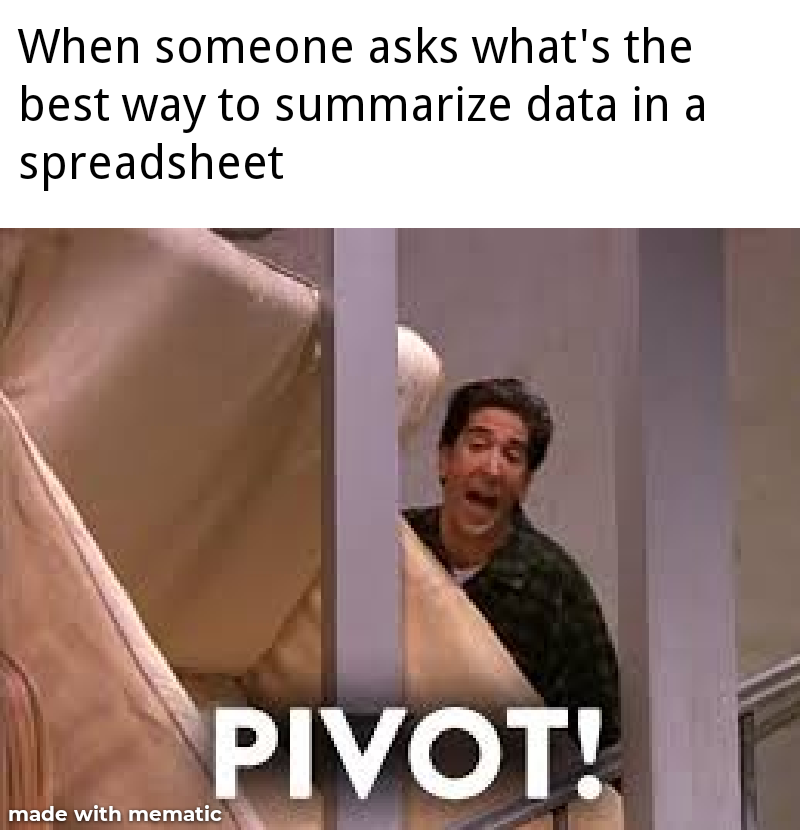
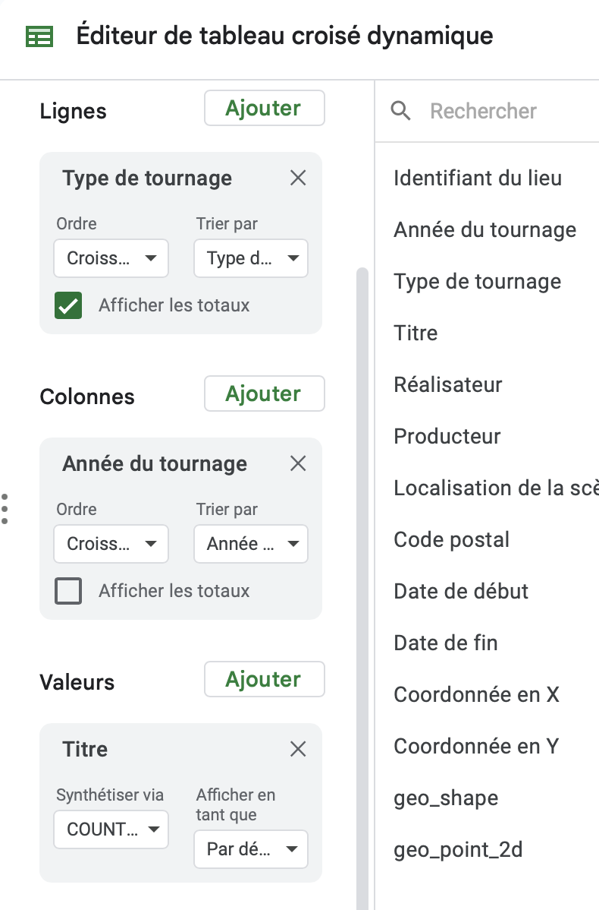
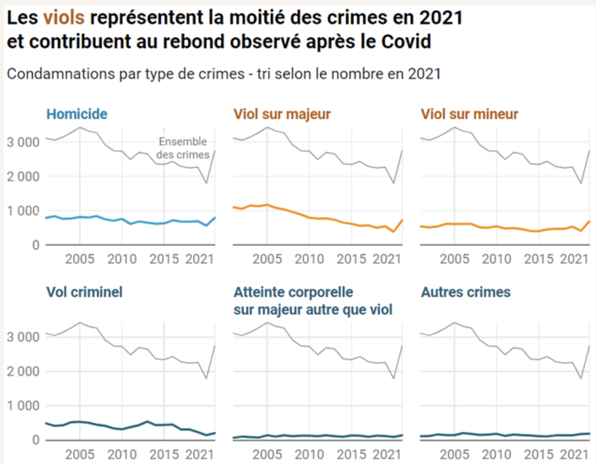

## Cette présentation en ligne

<https://samgoeta.github.io/donnees-information-savoirs/>

Sources : <https://github.com/samgoeta/donnees-information-savoirs>

Ces slides sont librement réutilisables selon les termes de la licence [Creative Commons 4.0 BY-SA](#0).

{fig-align="center" width="90" height="31"}

# Syllabus du cours {background-color="#173541"}

## Description du cours

À l'ère dite du **big data**, l'attention portée sur les données toujours plus massives, véloces et diverses tend à occulter un phénomène plus large : celui de la **mise en données du monde** ou **"datafication"** selon l'expression de Kenneth Cukier.

On ne numérise pas seulement des documents, mais **tous les aspects de la vie** qui sont capturés et mis en circulation sous la forme de données.

Ce cours s'inscrit dans le mouvement de la **"data literacy"** qui considère que la compréhension et l'usage des données doivent devenir des **compétences essentielles** comme lire, écrire ou compter pour :

-   Comprendre l'environnement informationnel contemporain
-   Exercer son esprit critique
-   Ne pas subir la **"boîte noire"** des données

## La pyramide de l'information

::::: columns
::: {.column width="70%"}

:::

::: {.column width="30%"}
Le cours suit la figure courante de la **pyramide de l'information** qui positionne les données comme le matériau brut de l'information et du savoir.
:::
:::::

## Objectifs pédagogiques

Les données apparaissent souvent comme un objet lointain, réservé à une élite de spécialistes. **Ce cours vise à démocratiser leur compréhension.**

À l'issue de ce cours, vous serez capables de :

-   Intégrer une dimension données dans la compréhension des enjeux informationnels
-   Être capable de comprendre les enjeux liés aux données
-   Avoir des éléments de compréhension sur la circulation et la réutilisation des données
-   Découvrir les nouvelles pratiques et les métiers associés aux données

## Compétences acquises

Concrètement, vous développerez les compétences suivantes :

-   Être **à l'aise** avec les notions de données, visualisation, data science et IA
-   **Comprendre** des métadonnées et le contenu d'un jeu de données
-   **Apprendre à chercher** des données pour ne pas se contenter d'informations pré-mâchées
-   **Réaliser** de premières analyses et visualisations

## Format pédagogique : la classe inversée

Le cours prend la forme d'une **classe inversée** :

<br/>

::::: columns
::: {.column width="50%"}
#### Avant chaque séance

-   Visionnage des enseignements magistraux sur **Amupod**
-   Préparation des notions clés
:::

::: {.column width="50%"}
#### Pendant chaque séance

1.  **Quiz** d'évaluation + explications
2.  **Activité** de mise en pratique
3.  **Témoignage** ou travail podcast
:::
:::::

## Plan du cours - Vue d'ensemble

Le cours est découpé en **cinq séances** thématiques :

::::: columns
::: {.column width="50%"}
1.  **Les données dans leur diversité**
2.  **Open data et circulation des données**
3.  **Visualisation des données**
:::

::: {.column width="50%"}
4.  **Data science**
5.  **Intelligence artificielle**
:::
:::::

## Modalités d'évaluation

La note finale se compose de deux éléments équilibrés :

::::: columns
::: {.column width="50%"}
#### Quiz (/10)

-   Moyenne des quiz de début de séance
-   Sur la plateforme **Equinox**
-   En présentiel uniquement
:::

::: {.column width="50%"}
#### Podcast Disquette (/10)

-   En groupe de 4-5 personnes
-   À rendre le **24 octobre 2025**
-   Consignes à la prochaine séance
:::
:::::

## Critères d'évaluation du podcast

Votre podcast sera évalué selon quatre critères :

-   **Clarté et qualité** du podcast
-   **Compréhension** des enjeux numériques
-   **Présentation** de l'œuvre choisie
-   **Qualité** de la critique développée

L'objectif est de démontrer votre capacité à analyser de manière critique les enjeux liés aux données.

## Balises d'usage de l'IA

Conformément aux préconisations de la convention citoyenne universitaire sur l'IA générative :

::::: columns
::: {.column width="50%"}
#### Quiz : Niveau 0 🚫

-   **Utilisation interdite**
-   Évaluations sur Equinox
-   Aucune aide externe autorisée
:::

::: {.column width="50%"}
#### Podcast : Niveau 2 ⚠️

-   **Utilisation limitée**
-   Amélioration d'un travail produit
-   Script écrit **sans IA**
-   Exercice créatif personnel
:::
:::::

# Introduction : la notion de données {background-color="#173541"}

## Les données, ça vous évoque quoi ?

<iframe allowfullscreen frameborder="0" height="100%" mozallowfullscreen style="min-width: 500px; min-height: 355px" src="https://app.wooclap.com/events/XNJQDS/questions/68c0a547a7e1dc8509a86629" width="100%">

</iframe>

## Les données, ça vous évoque quoi ?

<iframe allowfullscreen frameborder="0" height="100%" mozallowfullscreen style="min-width: 500px; min-height: 355px" src="https://app.wooclap.com/events/XNJQDS/questions/68c0b77950747a3c8004a74e" width="100%">

</iframe>

## La pyramide de l'information et du savoir

::::: columns
::: {.column width="70%"}

:::

::: {.column width="30%"}
Quelles critiques feriez-vous de ce modèle ?
:::
:::::

## Une tentative de définition exhaustive

::::: columns
::: {.column width="70%"}
> Les données sont généralement comprises comme étant la **matière première** produite dans **l’abstraction du monde** en catégories, mesures et autres formes de représentation - nombres, caractères, symboles, images, sons, ondes électromagnétiques, bits - qui constituent les **fondations sur lesquelles l’information et le savoir sont créés.**
:::

::: {.column width="30%"}

:::
:::::

## Challenge : simplifiez cette définition pour un enfant de 7 ans

::::: columns
::: {.column width="50%"}
> Les données sont généralement comprises comme étant la matière première produite dans l’abstraction du monde en catégories, mesures et autres formes de représentation - nombres, caractères, symboles, images, sons, ondes électromagnétiques, bits - qui constituent les fondations sur lesquelles l’information et le savoir sont créés.
:::

::: {.column width="50%"}
<iframe allowfullscreen frameborder="0" height="100%" mozallowfullscreen style="min-width: 500px; min-height: 355px" src="https://app.wooclap.com/events/XNJQDS/questions/68c0ba44b63c0d5157210640" width="100%">

</iframe>
:::
:::::

# Quiz sur la vidéo sur la diversité des données {background-color="#173541"}

# Activité : Les faits divers de l'open data {background-color="#173541"}

## Le point de départ



## 🎯 Objectifs de l'activité

#### Découvrir par la pratique

-   La richesse des données publiques sur **data.gouv.fr**
-   La structure d'une base de données (enregistrements, champs, documentation)
-   L'utilisation de l'explorateur de données

#### Développer un regard critique

-   Trouver la "bonne" donnée
-   Apprendre à filtrer et analyser
-   Dénicher une trouvaille dans une grande base de données

# 🍄 Étape 1 : Trouver votre "coin à champignons" (binôme - 30min) {background-color="#173541"}

## Votre mission

Identifiez une base de données **riche et prometteuse** sur data.gouv.fr

::::: columns
::: {.column width="40%"}
#### Méthode

1.  **Explorez les thématiques** : Culture, Sport, Éducation, Transports...
2.  **Sélectionnez une base** avec plusieurs milliers d'enregistrements
3.  **Vérifiez la richesse** : informations variées et surprenantes possibles
:::

::: {.column width="60%"}
#### Critères d'un bon "coin"

-   ✅ Documentation claire
-   ✅ Données "granulaires" avec un grand niveau de détail
-   ✅ Plusieurs champs intéressants
-   ✅ Des informations originales
:::
:::::

#### Vous avez trouvé ?

Renseignez dans **Notion** : nom, URL, producteur, nombre d'enregistrements, justification

## Exemple de "coins à champignons"

<iframe src="https://www.linkedin.com/embed/feed/update/urn:li:share:7184654189669539840" height="500" width="504" frameborder="0" allowfullscreen title="Post intégré">

</iframe>

## 💡Les réflexes devant un jeu de données

:::::: columns
::: {.column width="30%"}
✅ Retenir le **nom** du jeu de données

✅ Lire *attentivement* la **description**

✅ Regarder le **format** (SHP, XML, JSON… c'est compliqué)

✅ Regarder les **noms des fichiers**
:::

::: {.column width="40%"}

:::

::: {.column width="30%"}
✅ Connaître le **producteur** des données

✅ Chercher si possible d'ouvrir sur un "**portail externe**"

✅ Comprendre **à quoi correspond chaque ligne**

✅ Comprendre le contenu des **colonnes**
:::
::::::

## 💡 Conseil avec l'explorateur de données de data.gouv.fr

::::: columns
::: {.column width="40%"}
Utilisez **le petit entonnoir** en haut de chaque colonne pour explorer les valeurs les plus fréquentes et faire des filtres :
:::

::: {.column width="60%"}
Les valeurs les plus fréquentes dans une colonne peuvent vous aider à comprendre les données : {width="300"}
:::
:::::

## 🍄 Votre "coin à champignons"

<iframe src="https://samgoeta.notion.site/ebd/269f8843ac55804b8a21d04332de1a9d" width="100%" height="600" frameborder="0" allowfullscreen>

</iframe>

# 🎣 Étape 2 : pêche aux faits divers (binôme - 80min) {background-color="#173541"}

## Votre mission

Utilisez l'**explorateur de données** pour dénicher des informations **insolites, drôles ou surprenantes**

::::: columns
::: {.column width="50%"}
#### Techniques de recherche

-   **Mots-clés** : termes amusants, noms insolites
-   **Filtres numériques** : valeurs extrêmes
-   **Filtres géographiques** : comparaisons
-   **Filtres temporels** : évolutions surprenantes
:::

::: {.column width="50%"}
#### Méthode de travail

1.  **Lisez la documentation** complète
2.  **Testez les filtres** : combinaisons variées
3.  **Triez les données** : cherchez les extrêmes
4.  **Cherchez certains termes** : découvertes inattendues

#### Vous avez trouvé ?

Pour chacun, notez dans le formulaire Notion : fait formulé, URL, nom du groupe
:::
:::::

## Exemples d'inspiration

::::: columns
::: {.column width="50%"}
#### 🏷️ Marques déposées

> *"En 2020, 6 marques déposées incluent le mot 'merde' dans leur appellation, dont une marque de cosmétique 'Cacachic'"*
:::

::: {.column width="50%"}
#### ✈️ Déplacements officiels

> *"JP Raffarin comptabilise plus de déplacements (427) en 3 ans que François Mitterrand (356) en 14 ans de présidence"*
:::
:::::

## 

<iframe src="https://samgoeta.notion.site/ebd//32df8843ac55825596be814abb7b5426" width="100%" height="600" frameborder="0" allowfullscreen />

</iframe>

# Étape 3 : Vote et débriefing (10min) {background-color="#173541"}

## Les faits divers de l'an dernier


## Votez !

```{=html}
<iframe src="https://samgoeta.notion.site/ebd/26af8843ac5580ffbc2ecfb5095668e0" width="100%" height="600" frameborder="0" allowfullscreen></iframe>
```

# La fresque des données ouvertes {background-color="#173541"}

## De quoi parle-t-on ?

Adaptée de la fresque du climat, cette **fresque des données ouvertes** permet aux agents de sensibiliser et de s'approprier les éléments contextuels et historiques, mais aussi les enjeux et les leviers qu'offre l'ouverture des données.

Elle se déroule sous forme d'un **atelier participatif ludique**, où les participants utilisent des cartes de jeu représentant des éléments de l'écosystème des données ouvertes, et qu'ils doivent placer dans un ordre logique et relier les unes aux autres.

Le **contenu pédagogique se trouve écrit sur les cartes**, et la fresque vous permet de vous l'approprier.

Le jeu est animé par une personne qui apporte des compléments d'informations, questionne, réoriente le jeu.

Le but du jeu est de comprendre les relations entre les différentes cartes, les causalités, les conséquences.

A la fin du jeu, un temps d'échange permet de partager son expérience et son ressenti.

## A quoi ça ressemble ?

{fig-align="center" width="100%"}

## Les consignes

-   **Organisation pour 2 tables / des équipes** (entre 5 et 8 personnes par équipes)
-   **Disposition des 41 cartes sur les tables**
    -   Les cartes sont toutes mélangées et réparties sur la table
-   **Étapes (en 1h15) :**
    -   Prendre connaissance de **toutes les cartes**. [Notre conseil : Prendre le temps de lire les cartes]{style="color: #E95459;"}
    -   Disposer les cartes sur la fresque dans un ordre logique, échanges, discussions, débats
    -   Créer des liens de causalité entre les cartes, en les dessinant au feutre
-   **Racontez-nous votre fresque**
    -   3 questions : Qu'est ce que l'open data ? A quoi ça sert ? Comment on fait ?

## L'état d'esprit : l'escape game

::::: columns
::: {.column width="40%"}

:::

::: {.column width="60%"}
[Rassurez-vous, vous sortirez tous de la salle à l'heure prévue !]{style="color: #E95459;"}

**Quelques conseils pour réussir la fresque inspirés des escape games :**

-   **communiquez !** quand vous avez une information, partagez là
-   **fouillez !** enfin, non, tout est sur la table... Lisez attentivement les cartes
-   **créez du lien !** à vous d'inventer le lien logique entre les cartes et donner du sens à la fresque
-   **gardez un œil sur l'heure !** faites attention à ne pas perdre l'objectif final

[Nous sommes vos game masters, appuyez vous sur nous mais c'est à vous de faire la fresque !]{style="color: #E95459;"}

**Amusez-vous bien !**
:::
:::::

## Racontez-nous vos fresques

::::: columns
::: {.column width="50%"}
[En 3 minutes :]{style="color: #E95459;"}

-   **Qu'est ce que l'open data ?**
-   **A quoi ça sert ?**
-   **Comment on fait ?**
:::

::: {.column width="50%"}

:::
:::::

# Consignes pour le podcast Disquette {background-color="#173541"}

## Disquette ?

::::: columns
::: {.column width="40%"}

:::

::: {.column width="60%"}
Le numérique est partout mais, au milieu des récits alarmistes ou naïfs, il est difficile de repérer les bons contenus.

Sur le principe des bibliothèques idéales qui recensent les meilleurs contenus sur un sujet, Disquette vous fait découvrir de nouveaux contenus autour des enjeux du numérique en dépassant les idées reçues.

Documentaires, films, livres, BD, romans… tout a sa place dans Disquette.
:::
:::::

## Episodes precedents

[A ecouter avant d'enregistrer le votre !]{style="color: #E95459;"}


## Principes directeurs de Disquettes

::::: columns
::: {.column width="50%"}
#### Temps court

**8-10 minutes maximum** par groupe/par documentaire pour que cela reste audible
:::

::: {.column width="50%"}
#### Format rythmé

Plusieurs sequences identifiables avec alternance des voix, extraits, jingle...

[Personne ne doit parler seul plus d'une minute]{style="color: #E95459;"}

#### Ligne éditoriale

[Ce podcast est un "media" avec une ligne éditoriale pour le master comme l'est Chicane]{style="color: #E95459;"}
:::
:::::

## Déroulement du podcast

1.  **Jingle de début** : [À retrouver ici](https://public.3.basecamp.com/p/TUPJH2ud9g2BQDFWCNa1Dn4A)

2.  **Résumé court** \| Présenter le documentaire : qui, quoi, quand ? [Max 1min 30]{style="color: #E95459;"}

3.  **Extraits commentés**

    -   Un extrait commenté du documentaire par personne (1min par personne extrait compris)

    -   En résumer les enjeux, faire attention à ce que l’on comprenne l’extrait qu’on vient d’entendre (une phrase pour la décrire).

    -   Quand l'extrait est en anglais, il faut le doubler.

4.  **À la fin : mise en perspective.** Résumer le “grand enjeu” du doc, voilà ce qu’il nous enseigne des enjeux numériques de l’info’. (1 minutes maximum)

5.  **Une critique**

6.  **Jingle de fin uniforme**

# Séance 3 - La visualisation des données {background-color="#173541"}

## Objectifs de l'exercice

Vous allez produire une dataviz à partir des données que vous avez identifiées lors de la séance précédente.

::::: columns
::: {.column width="50%"}
🎯 **Vos missions :**

-   Comprendre la différence entre **données brutes** et **données agrégées**

-   Maîtriser les **tableaux croisés dynamiques** (pivot tables)

-   Choisir **votre propre base de données** à analyser

-   Créer une **dataviz dans Datawrapper**

-   Appliquer les **3 critères** : Rigueur, Lisibilité, Éloquence
:::

::: {.column width="50%"}

:::
:::::

------------------------------------------------------------------------

## Données brutes vs données agrégées

**Définition (Wikipedia)** \> Les données brutes sont les données non interprétées émanant d'une source primaire, ayant des caractéristiques liées à celle-ci et qui n'ont été soumises à aucun traitement ou toute autre manipulation.

::::: columns
::: {.column width="50%"}
**📈 Des données agrégées**

```         
| Mois | Montant total |
| Jan 2024 | 2 450 000 € |
| Fév 2024 | 1 980 000 € |
```

✅ Prêtes pour visualisation\
❌ Perdent le détail
:::

::: {.column width="50%"}
\*\* 📋 Des données brutes\*\*

```         
ID | Objet | Montant | Offres
2024090 | Nettoyage | 85500 | 4
2023054 | Bibliothèque | 865653 | 1
```

✅ Détail maximum\
❌ **À transformer pour analyser**
:::
:::::

## Une ressource pour vous aider à choisir le bon format de dataviz


Source : "[A friendly guide to choosing a chart type](https://www.datawrapper.de/blog/chart-types-guide) de Datawrapper, un MUST pour choisir le bon format de visualisation en fonction de votre intention"

## Les tableaux croisés dynamiques

::::: columns
::: {.column width="50%"}
Ils sont essentiels pour transformer vos **données brutes** en **données visualisables**

Les tableaux croisés dynamiques permettent de :

-   **Regrouper** par catégories
-   **Calculer** totaux, moyennes
-   **Filtrer** données pertinentes
:::

::: {.column width="50%"}

:::
:::::

## Comment créer une pivot table

::::: {.columns}
::: {.column width="40%"}

:::

::: {.column width="60%"}
**1. Importer données brutes**

-   Google Sheets : Fichier → Importer
-   Vérifier colonnes bien séparées
-   Nettoyer données manquantes

**2. Créer la pivot table**

-   Sélectionner toutes les données
-   **Insertion → Tableau croisé dynamique**
-   Choisir "Nouvelle feuille"

**3. Configurer**

-   **Lignes :** Variable à regrouper
-   **Valeurs :** Variable à calculer\
-   **Fonction :** MOYENNE, SOMME, NOMBRE
:::
::::

## Choisir votre base de données

Je vous conseille d'utiliser les données que vous avez exploré lors de la dernière séance.

Sinon vous pouvez vous appuyer sur les données identifiées par les autres binômes : 
[données identifiées](https://samgoeta.notion.site/269f8843ac558054819cea8f617c8f6f?v=269f8843ac5580daba3f000cb32c3e95&pvs=74)

## A vous de produire une dataviz

:::: columns
::: {.column width="40%"}

:::

::: {.column width="60%"}

✅ Titre annonce le contenu 

✅ Sous-titre explique la nature des données 

✅ La dataviz fait passer un message

✅ Le format est adapté à votre intention 

✅ Vous donnez une ou plusieurs clés de lecture
:::
:::::

## Évaluation par les pairs

Chaque groupe évaluera le travail d'un autre selon **3 critères :**

:::: {.columns}

::: {.column width="40%"}

:::

::: {.column width="60%"}

**🎯 RIGUEUR**

-   Nature des données explicite
-   Échelles appropriées
-   Source mentionnée

**👁️LISIBILITE**

-   Format adapté au message
-   Visualisation claire
-   Guides de lecture efficaces

**💬 ÉLOQUENCE**

-   Message clair et direct
-   Titre évocateur
-   Points saillants mis en avant
:::

::::


# Des questions ? {background-color="#173541"}
::::::::
