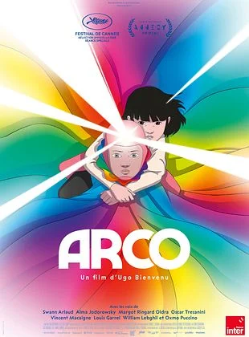
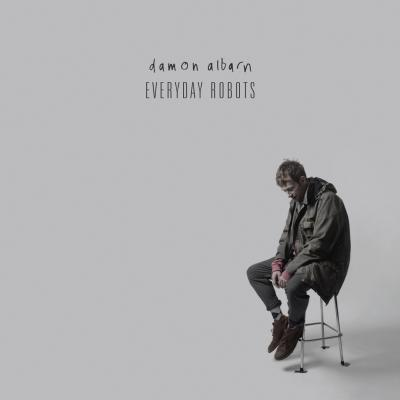

# Les œuvres au choix pour Disquette {background-color="#173541"}

## Comment choisir

::::: columns
::: {.column width="55%"}
#### Plusieurs œuvres, plusieurs formats

Chaque groupe choisit **une œuvre** dans la liste qui suit.

[Une œuvre ne peut être choisie que par un seul groupe]{style="color: #E95459;"}

Toutes ont été retenues parce qu'elles parlent des **enjeux numériques de l'information** sans tomber ni dans le récit alarmiste ni dans le récit naïf.
:::

::: {.column width="45%"}
#### Avant de vous décider

-   Vérifiez que l'œuvre est **accessible** (VOD, bibliothèque, librairie)
-   Vérifiez que vous pourrez en **extraire des extraits** exploitables au montage
-   Écoutez **un épisode existant** dans le même format
:::
:::::

## Invisibles — Les travailleurs du clic

::::: columns
::: {.column width="35%"}

:::

::: {.column width="65%"}
**Série documentaire** \| Henri Poulain (réalisation), Julien Goetz et Henri Poulain (écriture), d'après l'expertise éditoriale d'Antonio Casilli \| StoryCircus / France Télévisions, 2020 \| **4 épisodes de 26 min**

De Uber Eats à Facebook en passant par Google, la série part à la rencontre de celles et ceux qui travaillent de l'autre côté du clic : coursiers, micro-travailleurs, modérateurs. Ces plateformes répondent instantanément à nos besoins, au point qu'on oublie les milliers de personnes qui les font fonctionner au quotidien.

[Disponible sur France.tv Slash, YouTube et PeerTube]{style="color: #E95459;"}

#### Un angle possible

Que devient la promesse d'automatisation quand on découvre les humains cachés derrière l'algorithme ?
:::
:::::

## Sorry We Missed You

::::: columns
::: {.column width="35%"}

:::

::: {.column width="65%"}
**Film de fiction** \| Ken Loach, scénario de Paul Laverty \| Royaume-Uni, France, Belgique, 2019 \| **1h40** \| Distribution Le Pacte

Ricky, Abby et leurs deux enfants vivent à Newcastle. Abby s'occupe de personnes âgées à domicile, Ricky enchaîne les emplois mal payés. La révolution numérique semble leur offrir une chance : Abby vend sa voiture pour que Ricky achète une camionnette et devienne chauffeur-livreur à son compte. Les dérives de ce nouveau monde auront des conséquences majeures sur toute la famille.

[Sélection officielle, Festival de Cannes 2019]{style="color: #E95459;"}

#### Un angle possible

Comment le vocabulaire de l'indépendance et de la liberté sert-il à faire accepter la précarité ?
:::
:::::

## Arco

::::: columns
::: {.column width="35%"}

:::

::: {.column width="65%"}
**Film d'animation** \| Ugo Bienvenu, coécrit avec Félix de Givry \| France, 2025 \| **89 min** \| Distribution Diaphana

En 2075, Iris, dix ans, voit tomber du ciel un garçon vêtu d'une combinaison arc-en-ciel. C'est Arco, venu d'un futur lointain et idyllique où le voyage dans le temps est possible. Iris le recueille et va tout faire pour l'aider à rentrer chez lui. Une fable écologique portée par un message d'espoir, où technologie et nature coexistent au lieu de s'affronter.

[Cristal du long métrage, Festival d'Annecy 2025. Disponible en VOD]{style="color: #E95459;"}

#### Un angle possible

À quoi ressemble un récit d'anticipation **non dystopique** ? Que gagne-t-on, et que perd-on, à refuser le catastrophisme ?
:::
:::::

## Toy Story 5

::::: columns
::: {.column width="35%"}

:::

::: {.column width="65%"}
**Film d'animation** \| Andrew Stanton, coréalisé par McKenna Harris \| Pixar, 2026 \| Musique de Randy Newman

Bonnie, huit ans, reçoit Lilypad, une tablette connectée en forme de grenouille, censée l'aider à se faire des amis. Elle en devient rapidement dépendante et délaisse ses jouets. Pour Woody, Buzz, Jessie et les autres, l'adversaire n'est plus un jouet plus récent ni un placard oublié : c'est un objet qui capte l'attention de l'enfant et prétend savoir mieux qu'eux ce qui est bon pour elle.

[Sorti en juin 2026, plus de 880 millions de dollars de recettes mondiales en un mois]{style="color: #E95459;"}

#### Un angle possible

Le film a été critiqué pour l'hypocrisie de son message : Disney dénonce les écrans qui détournent les enfants des jouets, alors que la franchise tire des milliards de la vente de ces mêmes jouets — et que beaucoup d'enfants verront le film sur une tablette. Un discours critique sur la technique peut-il tenir quand il est produit par ceux qui en vivent ?
:::
:::::

## Carbone & Silicium

::::: columns
::: {.column width="35%"}

:::

::: {.column width="65%"}
**Bande dessinée** \| Mathieu Bablet \| Ankama, Label 619, 2020 \| **267 pages** \| Postface d'Alain Damasio

En 2046, une population humaine vieillissante a construit des robots pour prendre soin d'elle. Carbone et Silicium sont les prototypes d'une nouvelle génération. Avides de découvrir le monde extérieur, ils échappent à leurs créateurs et se retrouvent séparés pendant plusieurs siècles, traversant catastrophes climatiques et bouleversements des sociétés humaines.

[Prix BD Fnac France Inter 2021]{style="color: #E95459;"}

#### Un angle possible

Une IA qui dure des siècles change l'échelle du problème : qu'est-ce que la mémoire, l'obsolescence et la maintenance des machines nous disent de nous ?
:::
:::::

## Vallée du silicium

::::: columns
::: {.column width="35%"}

:::

::: {.column width="65%"}
**Essai** \| Alain Damasio \| Seuil, 2024 \| **Édition poche Folio SF, 2025, 309 pages**

À San Francisco, au cœur de la Silicon Valley, Damasio met à l'épreuve sa propre pensée technocritique. Sept chroniques littéraires et une nouvelle de science-fiction : du siège d'Apple aux quartiers dévastés par la drogue, il interroge la prolifération des IA, l'art de coder, les métavers, les voitures autonomes et l'avenir de nos corps.

[Les chroniques sont autonomes : vous pouvez n'en travailler que deux ou trois]{style="color: #E95459;"}

#### Un angle possible

Damasio annonce vouloir « changer d'axe et de regard ». Tient-il cette promesse, ou retrouve-t-on la critique attendue ?
:::
:::::

## Palais d'argile

::::: columns
::: {.column width="35%"}

:::

::: {.column width="65%"}
**Album** \| Feu! Chatterton \| 2021 \| Réalisé par Arnaud Rebotini

Troisième album du groupe, présenté par sa maison de disques comme une fresque cyberpunk pour les temps confinés, un pamphlet adressé à la start-up nation obsédée par le progrès et une ode à la nature. Le single **Monde nouveau** interroge frontalement le rapport de l'homme à la machine.

#### Un angle possible

Que peut dire une chanson sur la technique que ne dit pas un documentaire ? Travaillez le texte **et** le son : les machines sont dans la production autant que dans les paroles.
:::
:::::

## Everyday Robots

::::: columns
::: {.column width="35%"}

:::

::: {.column width="65%"}
**Album** \| Damon Albarn \| Parlophone, 2014 \| **12 titres** \| Produit par Richard Russell, avec Brian Eno et Natasha Khan

Premier album solo du chanteur de Blur et Gorillaz, enregistré dans son studio londonien. Le disque le plus autobiographique de sa carrière, nourri par les travers de l'existence moderne : jeux vidéo, téléphones portables, nature contre technologie. Le morceau-titre décrit des humains devenus des robots ordinaires, penchés sur leurs écrans en rentrant chez eux.

#### Un angle possible

L'album a plus de dix ans. Ce qu'il décrivait comme une inquiétude est-il devenu une banalité — et qu'est-ce que ça nous apprend ?
:::
:::::

## Ce que votre format implique

::::: columns
::: {.column width="50%"}
#### Documentaire et film

-   Les extraits sonores sont **directement exploitables**
-   Pensez à **doubler** les extraits en anglais
-   Attention à ce qu'on comprenne l'extrait sans l'image
:::

::: {.column width="50%"}
#### BD, essai, album

-   Pour la BD et l'essai, l'extrait est **lu à voix haute** : choisissez-le court et travaillez la lecture
-   Pour un album, le morceau **est** l'extrait : ne le laissez pas tourner sous votre voix
-   Décrivez ce qu'on ne peut pas entendre : une planche, une mise en page, un arrangement
:::
:::::

[Rappel : 8 à 10 minutes maximum, personne ne parle seul plus d'une minute]{style="color: #E95459;"}
